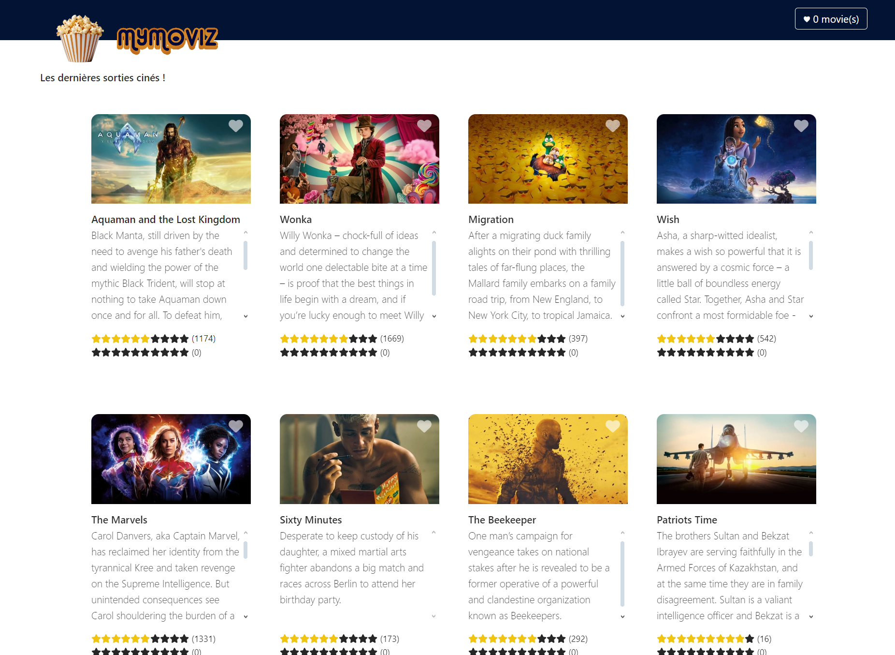

# MyMoviz | Frontend

MyMoviz is an application allowing you to display the latest released films with the possibility of adding a film to your favorites, managing a view counter and evaluating each of the films presented.

Want to see the backend? [It's here](https://github.com/valeneb/mymoviz-backend).

## 🛠️ Tech Stack

 - React

## 🎬 View in production

## 📰 License

Distributed under the MIT License. See LICENSE.txt for more information.
